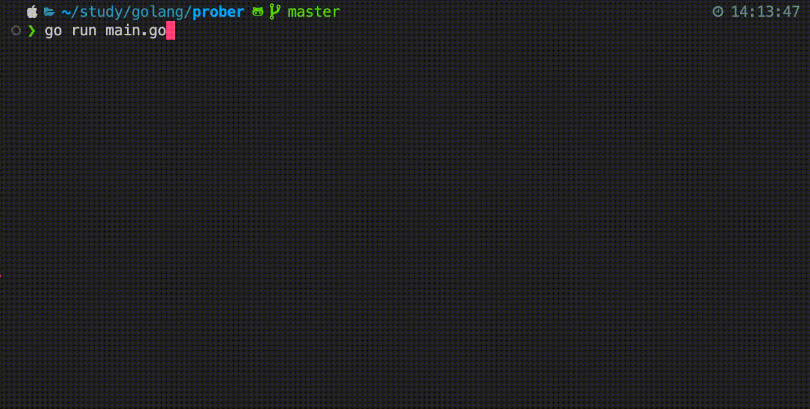

<h2 align="center">TUI utility for copying files</h2>

<a href="./main.go">
  
</a>

### Features
- Written in Go
- Supports MacOS, Windows
- Beta version

### Installation

For now, you can install it from the source code. Make sure you have Go installed on your machine.

```bash
go install github.com/nguyendhst/copyfile@latest
```